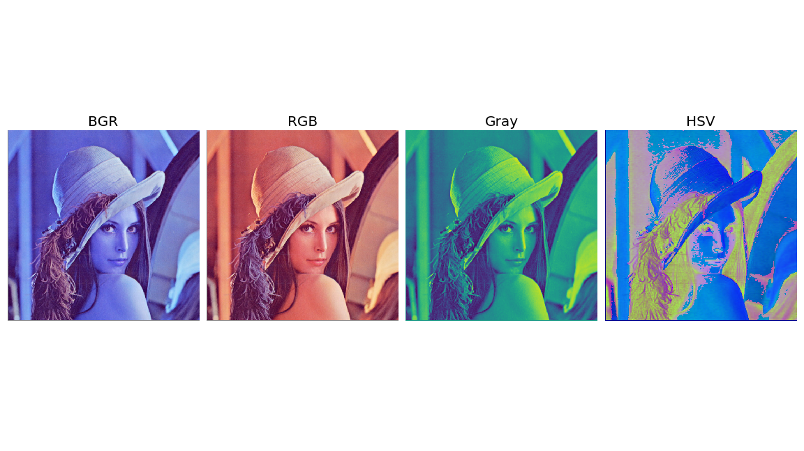
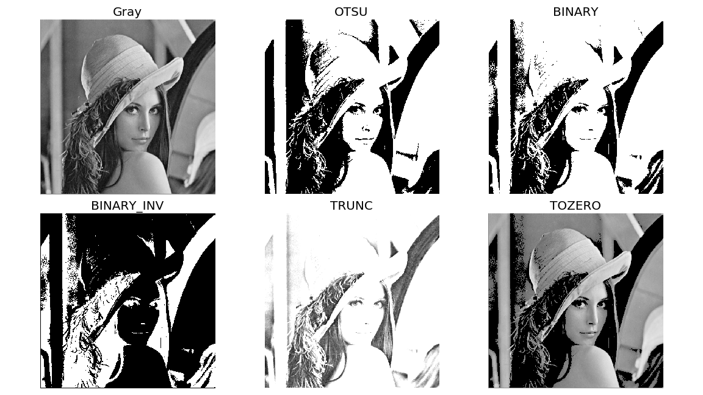
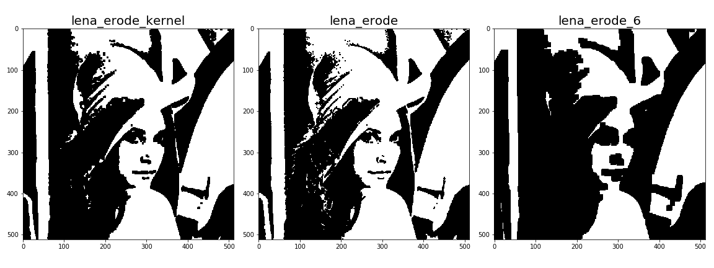
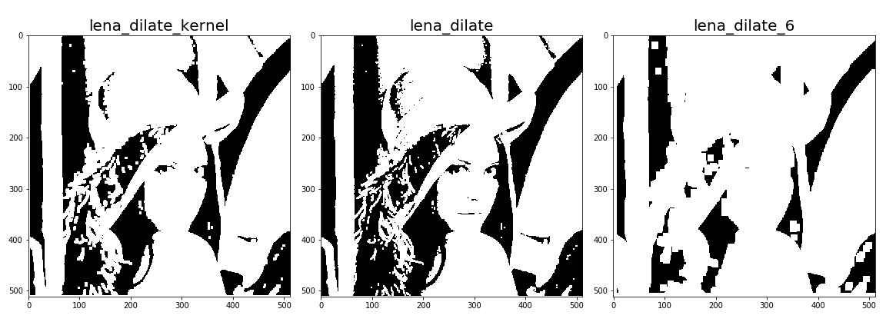
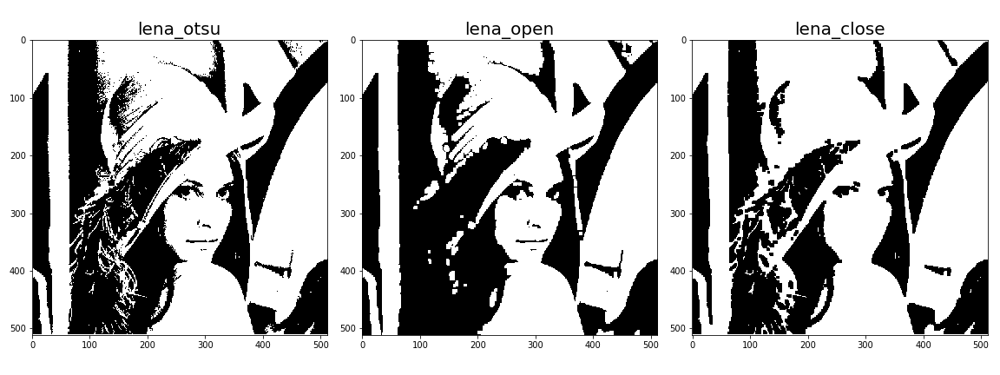

## 颜色空间转换

- 颜色空间转换允许我们将图片的颜色从一个颜色空间映射到另外一个颜色空间，从而进行下一步的处理。
- 在OpenCv中，我们通过`cv2.cvtColor(input_image, flag)`来进行转换，返回的是转换后的图像。
- OpenCv支持多种颜色空间的相互转换，我们可以通过以下命令查看所接受的类型：
```python
import cv2
flags = [i for i in dir(cv2) if i.startswith('COLOR_')]
print(flags)
```
- 我们常用的有几种转换：BGR <=> Gray, BGR <=> RBG, BGR <=> HSV。*注意：OpenCv读取的图片的结果默认为BGR格式*。
```python
# 读取图片
lena = cv2.imread('Lena.png')
# BGR转RGB
lena_RGB = cv2.cvtColor(lena,cv2.COLOR_BGR2RGB)
# BGR转GARY
lena_GRAY = cv2.cvtColor(lena,cv2.COLOR_BGR2GRAY)
# BGR转HSV
lena_HSV = cv2.cvtColor(lena, cv2.COLOR_BGR2HSV)
```



## 图像阈值
- 图像阈值转换主要做一件事情：**对于每一个像素点，当这个像素点的值大于给定阈值时，就设为最大值；否则，我们将这个像素点设为0。**

- 在OpenCV中，我们通过`cv.threshold`来实现：
```python
retval, dst = cv.threshold(src, thresh, maxval, type[, dst] )
"""
src： 图像
thresh: 阈值
maxval: 最大值
type：转化的方法
"""
```

- 我们可以用多种方式（type）来转化进行转换：

Type|Decription
--|--
cv2.THRESH_BINARY | $dst(x,y) = \begin{aligned} \begin{cases} \textbf{maxval}, &src(x,y) >  \textbf{thresh} \\ 0,  &\text{otherwise} \end{cases} \end{aligned} $
cv2.THRESH_BINARY_INV | $dst(x,y) = \begin{aligned} \begin{cases} 0, &src(x,y) >  \textbf{thresh} \\ \textbf{maxval},  & \text{otherwise} \end{cases} \end{aligned} $
cv2.THRESH_TRUNC |  $dst(x,y) = \begin{aligned} \begin{cases} \textbf{thresh}, &src(x,y) >  \textbf{thresh} \\src(x,y) ,  &\text{otherwise} \end{cases} \end{aligned} $
cv2.THRESH_TOZERO| $dst(x,y) = \begin{aligned} \begin{cases} src(x,y) , &src(x,y) >  \textbf{thresh} \\ 0 ,  &\text{otherwise} \end{cases} \end{aligned} $
cv2.THRESH_TOZERO_INV | $dst(x,y) = \begin{aligned} \begin{cases} 0 , &src(x,y) >  \textbf{thresh} \\ src(x,y) ,  &\text{otherwise} \end{cases} \end{aligned} $
cv2.THRESH_MASK | 
cv2.THRESH_OTSU | use Otsu algorithm to choose the optimal threshold value 
cv2.THRESH_TRIANGLE | use Triangle algorithm to choose the optimal threshold value

```python 
# 读取图片， 转成灰度
lena = cv2.imread('fig/Lena.png')
lena_GRAY = cv2.cvtColor(lena,cv2.COLOR_BGR2GRAY)

ret_1, lena_otsu = cv2.threshold(lena_GRAY,100,255,cv2.THRESH_OTSU)
ret_2, lena_binary = cv2.threshold(lena_GRAY,100,255,cv2.THRESH_BINARY)
ret_3, lena_binary_inv = cv2.threshold(lena_GRAY,100,255,cv2.THRESH_BINARY_INV)
ret_4, lena_trunc = cv2.threshold(lena_GRAY,100,255,cv2.THRESH_TRUNC)
ret_5, lena_tozero = cv2.threshold(lena_GRAY,100,255,cv2.THRESH_TOZERO)

titles = ['Gray','OTSU','BINARY','BINARY_INV','TRUNC','TOZERO']
images = [lena_GRAY, lena_otsu, lena_binary, lena_binary_inv, lena_trunc, lena_tozero]

plt.figure(figsize=(16,9))
for i in range(6):
    plt.subplot(2,3,i+1)
    plt.imshow(images[i],'gray')
    plt.title(titles[i],fontsize=20)
    plt.axis('off')
plt.tight_layout()
plt.savefig('fig/gray.png')
```


## 形态学转换

### Erosion(腐蚀)
- 黑色侵蚀白色区域。腐蚀运算是利用一个模板，对图像进行遍历，当这个图像区域跟模板重合的时候，将保留图像，当图像区域与模板不同时，将当前区域变成1（黑色）。

- 在OpenCV里，我们通过`cv2.erode`进行腐蚀运算：
```python
"""
cv2.erode(src, kernel[, dst[, anchor[, iterations[, borderType[, borderValue]]]]])
src：二值图像
kernel: 比对的模板
iterations：运算的次数
"""
kernel = np.ones((5,5),np.uint8)
lena_erode_kernel = cv2.erode(lena_otsu,kernel,iterations = 1) 
lena_erode = cv2.erode(lena_otsu,None,iterations = 1) 
lena_erode_6 = cv2.erode(lena_otsu,None,iterations = 6) 
```


### Dilation(膨胀)
- 白色膨胀，膨胀运算，同理也是用模板对图片进行遍历，如果原图像有一个点落在模板上，那么这个区域就变成白色，否则，就保留图像。

- 在OpenCV里，我们通过`cv2.dilate`进行腐蚀运算：
```python
"""
cv2.dilate(src, kernel[, dst[, anchor[, iterations[, borderType[, borderValue]]]]])
src：二值图像
kernel: 比对的模板
iterations：运算的次数
"""
kernel = np.ones((5,5),np.uint8)
lena_dilate_kernel = cv2.dilate(lena_otsu,kernel,iterations = 1) 
lena_dilate = cv2.dilate(lena_otsu,None,iterations = 1) 
lena_dilate_6 = cv2.dilate(lena_otsu,None,iterations = 6) 
```


### opening 和 closing
- opening 和 closing是一对相反的运算，opening是对图像先腐蚀后膨胀，目的是**去掉黑色区域的白噪音**。closing是对图像先膨胀后腐蚀，目的是去除白色区域内的黑色点点（噪音）。
```python
"""
cv2.morphologyEx(img, op, kernel,iteration)
src：二值图像
op: 需要进行的操作，详见MorthTypes
kernel: 比对的模板
iterations：运算的次数
"""
```

MorthTypes | Description
--|--
cv.MORPH_ERODE | 腐蚀，同：cv2.erode()
cv.MORPH_DILATE | 膨胀，同：cv2.dilate()
cv.MORPH_OPEN | opening = dilate(erode(src,element))
cv.MORPH_CLOSE | closing = erode(dilate(src,element))
cv.MORPH_GRADIENT | morph_grad(src,element)=dilate(src,element)−erode(src,element)
cv.MORPH_TOPHAT | tophat(src,element)=src−open(src,element)
cv.MORPH_BLACKHAT | blackhat(src,element)=close(src,element)−src
cv.MORPH_HITMISS |

```python
lena_open = cv2.morphologyEx(lena_otsu, cv2.MORPH_OPEN, kernel)
lena_close = cv2.morphologyEx(lena_otsu, cv2.MORPH_CLOSE, kernel)
```
